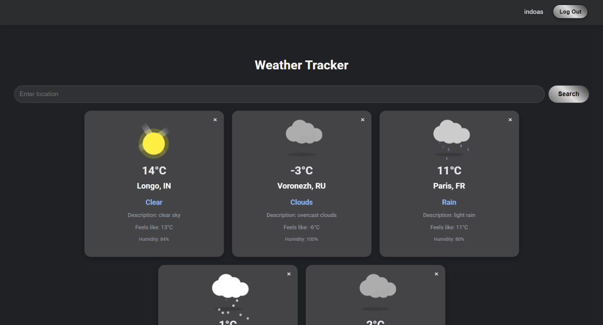

# Проект “Погода”

---

## Описание проекта
Проект “Погода” представляет собой веб-приложение для просмотра текущей погоды в различных локациях. Пользователь может зарегистрироваться, войти в систему, добавить интересующие его места в список и получать актуальную информацию о погоде через OpenWeather API. Приложение поддерживает многопользовательский режим, хранение данных в базе и удобный веб-интерфейс.

---

## Функционал приложения

### 1. Пользователи
#### **Регистрация**
При регистрации пользователь указывает логин и пароль. Для предотвращения ошибок реализована валидация данных:
- Логин должен быть от 5 до 10 символов, содержать только латиницу и цифры.
- Пароли должны совпадать и соответствовать минимальным требованиям безопасности (валидация выполняется в `SignUpUserDtoValidator`).

При успешной регистрации данные пользователя сохраняются в базе данных, а пароль шифруется с использованием `PasswordService` для повышения безопасности.

#### **Авторизация**
Пользователь вводит логин и пароль для входа в систему. Реализованы следующие проверки:
- Наличие пользователя в базе.
- Соответствие пароля с сохранённым (выполняется через `SignInService`).

Если данные корректны, создаётся сессия, а в браузере устанавливается cookie с идентификатором сессии.

#### **Выход (logout)**
Пользователь может выйти из системы, нажав кнопку выхода. При этом:
- Сессия удаляется из базы данных.
- Cookie очищаются из браузера.

---

### 2. Локации
#### **Добавление локаций**
Пользователь может добавить локацию в свой список, указав:
- Название города.
- Координаты (широта и долгота).

Эти данные передаются в `LocationService`, где:
- Проверяется существование пользователя в базе.
- Локация сохраняется в таблице `locations` с привязкой к пользователю.

#### **Просмотр списка локаций**
На главной странице пользователь видит список добавленных локаций с их текущей погодой:
- Название города.
- Текущая температура и погодные условия (обновляются при загрузке страницы с использованием OpenWeather API).

Если список локаций велик, добавлена пагинация для удобной навигации.

#### **Удаление локаций**
Локацию можно удалить из списка, нажав соответствующую кнопку. Запрос обрабатывается `LocationController`, который удаляет данные из базы с помощью `LocationService`.

---

### 3. Работа с сессиями
Сессии используются для хранения авторизации пользователя и обеспечивают удобный доступ к системе.

#### **Создание сессии**
- После успешной авторизации в таблице `sessions` создаётся запись с уникальным UUID и временем истечения (`expires_at`).
- Идентификатор сессии сохраняется в cookie браузера.

#### **Проверка сессий**
- На каждый запрос к серверу `SessionInterceptor` проверяет наличие cookie и его соответствие в базе данных.
- Если сессия истекла, она удаляется из базы, а пользователь перенаправляется на страницу авторизации.

#### **Удаление просроченных сессий**
- `SessionCleanupService` автоматически удаляет сессии, срок действия которых истёк. Очистка запускается каждые 60 минут с использованием Spring Scheduler.

#### **Связь с пользователями**
Каждая сессия привязана к конкретному пользователю через `@ManyToOne` связь в модели `Session`.

---

### 4. Архитектура и технологии

#### **Модели данных**
1. **User**:
    - Поля: `id`, `login`, `password`.
    - Связь:
        - Один пользователь может иметь несколько сессий (`@OneToMany`).
        - Один пользователь может быть привязан к нескольким локациям (`@OneToMany`).

2. **Session**:
    - Поля: `id` (UUID), `expires_at`.
    - Связь: `@ManyToOne` с пользователем.

3. **Location**:
    - Поля: `id`, `name`, `latitude`, `longitude`.
    - Связь: `@ManyToOne` с пользователем.

#### **Ключевые технологии**
- **Backend**:
    - Java
    - Spring MVC (контроллеры, сервисы, перехватчики)
    - Hibernate для работы с базой данных
    - PostgreSQL для хранения данных
    - Liquibase для управления миграциями базы
- **Frontend**:
    - Thymeleaf (динамические шаблоны)
    - HTML, CSS, Bootstrap
- **API**:
    - OpenWeather API для получения данных о погоде
- **Контейнеризация**:
    - Docker для изоляции и развертывания приложения
    - Docker Compose для управления многосервисной архитектурой.

---

